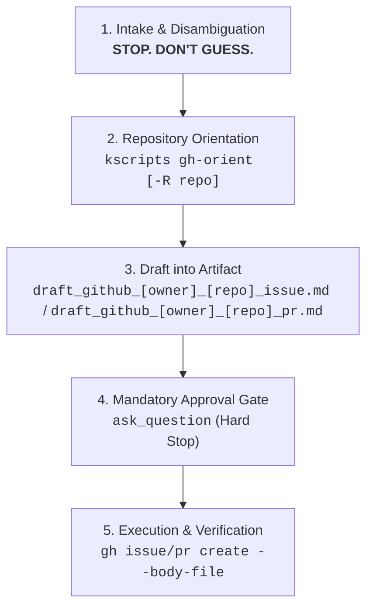

# GitHub Post (`/gh-post`)

Guidelines, automated orientation tooling, and execution protocols for authoring
and submitting high-signal, anti-slop GitHub issues and pull requests without AI
formatting noise.

## Quick Start

```bash
# Orient with a local Git repository checkout's conventions:
kscripts gh-orient --dir /path/to/repo

# Orient with a remote GitHub repository (zero local clone required):
kscripts gh-orient -R invertase/melos
```

## Invocation Style & Slash Command

Trigger the skill via the `/gh-post` slash command or natural language
equivalents:

```markdown
/gh-post a PR with these changes
/gh-post a new issue requesting the feature we discussed
/gh-post a bug report for the crash when passing empty config
/gh-post draft a feature proposal for smart dependent versioning in invertase/melos
```

## The 5-Step Workflow



---

### Step 1: Intake & Disambiguation (STOP. DON'T GUESS.)

The agent MUST have crystal-clear clarity on two fundamental parameters before
doing any work:

1. **Target Post Type**: Is this an **Issue** (Bug Report, Feature Proposal) or
   a **Pull Request**?
2. **Target Repository**: Which exact GitHub repository (`owner/repo`)?

> [!IMPORTANT]
>
> **STOP. DON'T GUESS.** If the user's intent is ambiguous (e.g. _"create a post
> for this"_ without specifying Issue vs. PR), or if the target repository
> cannot be deterministically resolved from the current git checkout, or if
> multiple remotes/forks exist: **The agent MUST STOP and explicitly ask the
> user for clarification** using `ask_question` or chat before proceeding. Never
> guess or fabricate targets.

---

### Step 2: Repository Orientation

Before drafting, run `kscripts gh-orient` (or the bare `gh-orient` shim) to
inspect the target repository's maintainers, title prefixes, label vocabulary,
and native templates:

```bash
# For a local git repository checkout:
kscripts gh-orient --dir <path-to-repo>

# For a remote repository (zero local clone required):
kscripts gh-orient -R invertase/melos
```

- **What it gathers**:
  - Active human maintainers and reviewers (filtering out automated bots).
  - Common issue title prefixes (`request:`, `[analyzer]`, `area/foo:`).
  - Common PR title prefixes (`feat(scope):`, `fix(scope):`, `chore:`).
  - Repository label vocabulary and detected issue/PR form schemas (`.yml` field
    IDs).
- **Slop Contagion Guardrail**: Use orientation output _strictly_ for taxonomy,
  prefixes, and template adherence. Do NOT adopt decorative slop, emojis, or
  conversational fluff found in historical repository posts.

---

### Step 3: Draft into an ARTIFACT First

Always draft the complete title and body into a dedicated Markdown artifact in
the conversation artifact directory (`<appDataDir>/brain/<conversation-id>/`)
before touching the GitHub CLI, explicitly namespaced by repository:

- **For Issues**: `draft_github_<owner>_<repo>_issue.md` _(e.g.,
  `draft_github_invertase_melos_issue.md` or
  `draft_github_kevmoo_scripts_dart_issue.md`)_
- **For Pull Requests**: `draft_github_<owner>_<repo>_pr.md` _(e.g.,
  `draft_github_invertase_melos_pr.md` or
  `draft_github_kevmoo_scripts_dart_pr.md`)_

Always provide `ArtifactMetadata` with `RequestFeedback: true` so the user can
review the rendered draft directly in the UI.

#### Core Philosophy & Anti-Slop Rules (Negative Invariants)

Maintainers suffer from low-effort LLM fatigue. A good submission takes under 15
seconds to triage. Strictly enforce:

- **No Decorative Emojis**: Never prefix titles, headers, or bullet points with
  emojis (`🚀`, `🐛`, `📋`, `💡`, `✨`, `⚠️`, `🔍`).
- **No Gratuitous Dividers**: Do not insert `---` horizontal rules between every
  minor section. Standard Markdown headers (`###`) provide sufficient hierarchy.
- **No Conversational Fluff or Pleasantries**:
  - Omit opening pleasantries (_"While investigating the codebase..."_, _"I hope
    this helps..."_).
  - Omit closing pleasantries (_"Let me know what you think!"_, _"I would be
    happy to submit a PR..."_).
- **No Speculative Architecture Essays**:
  - In bug reports: State the observed defect, provide exact error logs/repro
    steps, and limit proposed fixes to 1–2 factual sentences (or omit entirely).
  - In PRs: Explain strictly the rationale ("why") and the isolated diff ("what
    changed").
- **No Inline Multiline Shell Escapes**: Never pass multiline Markdown inline
  via `--body "line 1\nline 2"`. Always use `--body-file`.

---

### Step 4: Mandatory Approval Gate (Hard Stop)

Before running `gh issue create` or `gh pr create`, the agent MUST halt
execution and prompt the user for explicit confirmation using `ask_question`.

```dart
// Example confirmation prompt
ask_question({
  questions: [
    {
      question: "I have prepared the draft in the artifact. Would you like to create the GitHub Issue now?",
      options: [
        "(Recommended) Yes, create issue via gh issue create",
        "No, keep as draft only"
      ]
    }
  ]
});
```

- **If Approved**: Proceed to Step 5.
- **If Declined / Paused**: Keep the artifact as draft and yield cleanly.

---

### Step 5: Execution & Verification

1. **Write Body to Temporary File**:
   ```bash
   # Extract the body content from the artifact to /tmp/post_body.md
   ```
2. **Execute Submission**:
   ```bash
   # For Issues:
   gh issue create -R owner/repo --title "[subsystem] Imperative Title" --body-file /tmp/post_body.md
   rm /tmp/post_body.md

   # For Pull Requests:
   gh pr create --title "feat(scope): imperative summary" --body-file /tmp/post_body.md
   rm /tmp/post_body.md
   ```
3. **Verify Output**: Confirm the submission succeeded and output the clickable
   link (`https://github.com/owner/repo/issues/123` or
   `https://github.com/owner/repo/pull/123`).

---

## Title Conventions & Disambiguation

Use concise, imperative titles (≤70 characters):

- **When Authoring an Issue**: Adopt the repository's issue prefix convention
  (e.g., `request: ...`, `[subsystem] ...`, `area/foo: ...`).
- **When Authoring a PR**: Adopt Conventional Commits (`feat(scope): ...`,
  `fix(scope): ...`, `refactor(scope): ...`) unless the repository explicitly
  mandates an alternative format.

| Post Type   | Format Pattern                      | High-Signal Example                                               | Slop Example to Avoid                            |
| :---------- | :---------------------------------- | :---------------------------------------------------------------- | :----------------------------------------------- |
| **Bug**     | `[subsystem] Failure on condition`  | `[analyzer] Crash with NullPointer when config.json is empty`     | `Bug in analyzer` or `[CRITICAL] System failure` |
| **Bug**     | `subsystem: Failure on condition`   | `cli: Flag --output fails when target directory is missing`       | `CLI tool is broken`                             |
| **Feature** | `[subsystem] Imperative capability` | `[auth] Support PKCE flow in OAuth2 authentication client`        | `Feature request: make authentication better`    |
| **Feature** | `request: Imperative capability`    | `request: avoid cascading releases when constraints allow update` | `Feature idea for melos`                         |
| **PR**      | `type(scope): imperative summary`   | `feat(orient): add remote repo support and bot filter`            | `Updates and fixes`                              |

---

## Standard Content Templates

### 1. Bug Report Template

````markdown
### Summary
1–2 sentence description of the failure and trigger condition.

### Steps to Reproduce
1. Execute `tool_name --flag value` (or minimal CLI command)
2. Pass input `<repro_input>`

### Observed Behavior
```text
<literal error output, exception message, or raw stack trace>
````

### Expected Behavior

<1–2 sentences describing the expected outcome>

### Environment / Target

- Target Commit / Version: `<commit_hash>`
- Runtime / Platform: `<e.g. Linux x86_64, Dart 3.8.0, Node 22>`

````

### 2. Feature Proposal Template

```markdown
### Context & Problem
1–2 sentences explaining what problem needs to be solved.

### Proposed Solution
Concrete description of the proposed interface, behavior, or flag.

### Acceptance Criteria
- [ ] Criterion 1
- [ ] Criterion 2

### Non-Goals
- What this feature explicitly does NOT cover
````

### 3. Pull Request Template

```markdown
### Rationale
1–2 sentences explaining why this change is needed.

### Summary of Changes
- Bulleted description of the concrete code changes
- Touch only what the task requires; no orphaned imports or unrelated diffs

### Verification
- Executed `dart test` with 100% pass
- Verified edge case `<repro_condition>` passes

Fixes #<issue_number>
```

---

## Mapping Standard Sections to GitHub YAML Issue Forms

When a repository uses GitHub Issue Forms (`.github/ISSUE_TEMPLATE/*.yml`), the
issue body is rendered as sequential H3 markdown sections matching each form
element's `label:` attribute. Map conceptual anti-slop sections to the form's
specific fields:

| Conceptual Section     | Common YAML Field IDs               | Rendered Form Heading                                   |
| :--------------------- | :---------------------------------- | :------------------------------------------------------ |
| **Trigger Command**    | `command`, `repro_command`          | `### Command`                                           |
| **Context & Problem**  | `description`, `context`, `problem` | `### Description` or `### Context`                      |
| **Reasoning / Impact** | `reasoning`, `motivation`           | `### Reasoning`                                         |
| **Proposed Solution**  | `solution`, `proposal`, `idea`      | `### Proposed Solution`                                 |
| **Additional Context** | `additional_context`, `comments`    | `### Additional Context` (put Acceptance Criteria here) |
