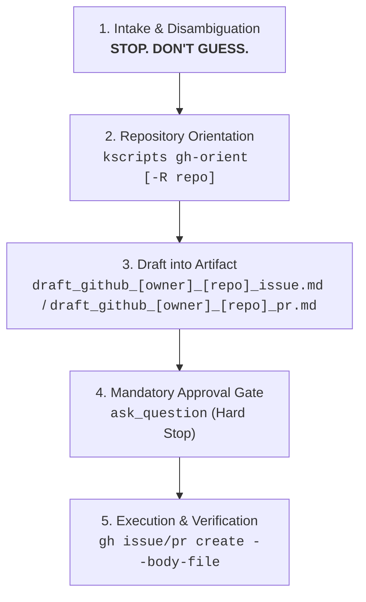

# GitHub Post (`/gh-post`)

Guidelines, automated orientation tooling, and execution protocols for authoring
and submitting high-signal, anti-slop GitHub issues and pull requests without AI
formatting noise.

## Quick Start

```bash
# Orient with a local Git repository checkout's conventions:
kscripts gh-orient --dir /path/to/repo

# Orient with a remote GitHub repository (zero local clone required):
kscripts gh-orient -R invertase/melos
```

## Invocation Style & Slash Command

Trigger the skill via the `/gh-post` slash command or natural language
equivalents:

```markdown
/gh-post a PR with these changes
/gh-post a new issue requesting the feature we discussed
/gh-post a bug report for the crash when passing empty config
/gh-post draft a feature proposal for smart dependent versioning in invertase/melos
```

## The 5-Step Workflow


```mermaid
graph TD
    A["1. Intake & Disambiguation<br><b>STOP. DON'T GUESS.</b>"] --> B["2. Repository Orientation<br><code>kscripts gh-orient [-R repo]</code>"]
    B --> C["3. Draft into Artifact<br><code>draft_github_[owner]_[repo]_issue.md</code> / <code>draft_github_[owner]_[repo]_pr.md</code>"]
    C --> D["4. Mandatory Approval Gate<br><code>ask_question</code> (Hard Stop)"]
    D --> E["5. Execution & Verification<br><code>gh issue/pr create --body-file</code>"]
```

### Step 1: Intake & Disambiguation (STOP. DON'T GUESS.)

The agent MUST have crystal-clear clarity on two fundamental parameters before
doing any work:

1. **Target Post Type**: Is this an **Issue** (Bug Report, Feature Proposal) or
   a **Pull Request**?
2. **Target Repository**: Which exact GitHub repository (`owner/repo`)?

> [!IMPORTANT]
>
> **STOP. DON'T GUESS.** If the user's intent is ambiguous (e.g. _"create a post
> for this"_ without specifying Issue vs. PR), or if the target repository
> cannot be deterministically resolved from the current git checkout, or if
> multiple remotes/forks exist: **The agent MUST STOP and explicitly ask the
> user for clarification** using `ask_question` or chat before proceeding. Never
> guess or fabricate targets.

### Step 2: Repository Orientation

Before drafting, run `kscripts gh-orient` (or the bare `gh-orient` shim) to
inspect the target repository's maintainers, title prefixes, label vocabulary,
and native templates:

```bash
kscripts gh-orient --dir <path-to-repo>
kscripts gh-orient -R <owner/repo>
```

- **What it gathers**: Active human maintainers (filtering out bots), common
  issue title prefixes (`request:`, `[analyzer]`, `area/foo:`), PR title
  prefixes (`feat(scope):`, `fix(scope):`, `chore:`), repository label
  vocabulary, and detected issue/PR form schemas (`.yml` field IDs).
- **Slop Contagion Guardrail**: Use orientation output _strictly_ for taxonomy,
  prefixes, and template adherence. Do NOT adopt decorative slop, emojis, or
  conversational fluff found in historical repository posts.

### Step 3: Draft into an ARTIFACT First

Always draft the complete title and body into a dedicated Markdown artifact in
the conversation artifact directory (`<appDataDir>/brain/<conversation-id>/`)
before touching the GitHub CLI, explicitly namespaced by repository:

- **For Issues**: `draft_github_<owner>_<repo>_issue.md`
- **For Pull Requests**: `draft_github_<owner>_<repo>_pr.md`

Always provide `ArtifactMetadata` with `RequestFeedback: false` and
`UserFacing: true` (gating execution via Step 4's `ask_question`). Consult
[`references/templates.md`](references/templates.md) for the complete Bug
Report, Feature Proposal, Pull Request templates, title pattern tables, and
GitHub YAML Issue Form field mappings.

#### Core Philosophy & Anti-Slop Rules (Negative Invariants)

Maintainers suffer from low-effort LLM fatigue. A good submission takes under 15
seconds to triage. Strictly enforce:

- **No Decorative Emojis on GitHub**: Never prefix published GitHub titles,
  headers, or bullet points with emojis (`🚀`, `🐛`, `📋`, `💡`, `✨`, `⚠️`).
- **No Gratuitous Dividers**: Do not insert `---` horizontal rules between every
  minor section. Standard Markdown headers (`###`) provide sufficient hierarchy.
- **No Conversational Fluff or Pleasantries**: Omit opening pleasantries
  (_"While investigating the codebase..."_) and closing pleasantries (_"Let me
  know what you think!"_, _"I would be happy to submit a PR..."_).
- **Single-Audience / One-Owner Split (`100% Relevance`)**: Never bundle bugs or
  action items spanning multiple distinct subsystems, packages, or teams into a
  single cross-cutting issue where only a small fraction is relevant to any
  given maintainer. Split distinct owners/subsystems into separate issues.
- **No Speculative Architecture Essays**:
  - In bug reports: State the observed defect, provide exact error logs/repro
    steps, and limit proposed fixes to 1–2 factual sentences (or omit entirely).
  - **Progressive Disclosure (`Tight Human Summary + <details>`) & AI
    Encapsulation**: Whenever an issue includes multiple root causes,
    import/bundle chains, benchmark tables, or AI-gathered code traces /
    inventories, keep the visible top-level gist `<= 8–12` lines (1-sentence
    trigger + 2–3 actionable bullets with exact commit/line permalinks + bolded
    `**from X to Y (Zx smaller/faster)**` impact bullets). Encapsulate the deep
    technical breakdown, code traces, and full tables inside a
    `<details><summary><b>Detailed Breakdown, Repro Steps & Measurements (AI-assisted)</b></summary>`
    block (always leave a blank line immediately after `</summary>` and before
    `</details>` so GitHub Flavored Markdown renders inner tables and code
    blocks).
  - In PRs: Explain strictly the rationale ("why") and the isolated diff ("what
    changed").
- **No Inline Multiline Shell Escapes**: Never pass multiline Markdown inline
  via `--body "line 1\nline 2"`. Always use `--body-file`.
- **Manual Web Form Mode**: If the user asks for a link to the repo's issue form
  to paste manually, strip `**Target Repository**:` / `**Proposed Title**:` from
  `draft_github_<owner>_<repo>_issue.md` so the file is 100% copy-pasteable body
  text, and provide a pre-filled
  `https://github.com/<owner>/<repo>/issues/new?title=...` URL artifact.

#### Explicit 3D Paranoia Header for PR Draft Previews (`OQ3`)

At the top of every PR draft artifact preview
(`draft_github_<owner>_<repo>_pr.md`) and in chat, display the computed **3D
Paranoia Classification** line:

```markdown
🛡️ Paranoia Tier: Ring <0..4B> (<Label>) · Confidence: <High|Low> · Door: <🚪 One-Way | 🔄 Two-Way>
```

| Dimension      | Values & Classification Rules                                                                                                                                                                                                                                                                                                                            |
| :------------- | :------------------------------------------------------------------------------------------------------------------------------------------------------------------------------------------------------------------------------------------------------------------------------------------------------------------------------------------------------- |
| **Reuse Ring** | `Ring 0` (Personal dotfiles & private configs: `personal_dotfiles`) · `Ring 2` (Public skills & utilities: `kevmoo_skills`, `scripts.dart`) · `Ring 3` (Published `pub.dev` packages: `analytica.dart`, `json_serializable`) · `Ring 4A` (Upstream Dart/Flutter framework & packages) · `Ring 4B` (Upstream C++, Dart VM internals, WIMP, Skwasm engine) |
| **Confidence** | `High` (Pure Dart, CLI, package & framework code) · `Low` (Unfamiliar C++, VM internals, WIMP/Skwasm/engine plumbing)                                                                                                                                                                                                                                    |
| **Door Type**  | `🚪 One-Way` (Public `api.txt` / CLI flag / JSON schema delta, SemVer `-wip` bump, DB migration, CI release workflow) · `🔄 Two-Way` (Internal `lib/src/` refactors, isolated tests, docs)                                                                                                                                                               |

_Note_: Strip the `🛡️ Paranoia Tier:` preview banner when writing
`/tmp/post_body.md` in Step 5 so the published GitHub PR body starts cleanly at
`### Rationale`.

#### Conditional `### Flow / Surface Delta` Rubric for PRs (`FU3`)

Include a compact ASCII flow or Mermaid diagram under `### Flow / Surface Delta`
(between `### Summary of Changes` and `### Verification`) **only** when at least
one trigger holds:

1. **Public API / CLI / Config Surface Changes**: `api.txt` changes, new or
   modified CLI flags/subcommands, exit codes, or config/JSON schemas (render a
   compact `Before -> After` ASCII or `diff` block `<= 12` lines).
2. **Multi-File Control-Flow or State Routing (`>= 3` files)**: `>= 3`
   production files have altered control-flow, pipeline stages, or state
   transitions (render a compact ASCII pipeline or `<= 6-node` Mermaid
   `flowchart LR` / `sequenceDiagram` with `<= 50 chars` per node label).
3. **Benchmark / Hot-Path Architecture Changes**: Algorithmic or hot-path
   performance changes (render a compact `Before vs. After` delta table).

**Omission Rule**: If none of the three triggers hold (e.g., isolated bug fix,
single-file refactor, test/doc update), **omit** `### Flow / Surface Delta`
entirely.

### Step 4: Two-Layer Pre-Chew Gate & Concise Change Explanation (Hard Stop)

Separate **Layer A (Internal Pre-Chew Brief for the human author)** from **Layer
B (Outbound GitHub Payload)**:

1. **Layer A (Internal Pre-Flight Brief)**: Before running `gh issue create` or
   `gh pr create`, emit a concise internal explanation (`<= 50` lines in chat or
   above the draft separator) covering (1) title & audience/routing rationale,
   (2) major code changes or verified root causes by file, and (3) test coverage
   executed. Never leak Layer A's internal forensic trace into the published
   GitHub body unless encapsulated inside a `<details>` appendix.
2. **Layer B (Outbound Payload Approval)**: Halt execution and prompt the user
   via `ask_question` so they can pre-chew/adjust the human gist or approve
   submission:
   - Option 1: `(Recommended) Yes, create <issue|PR> via gh <issue|pr> create`
   - Option 2: `No, keep as draft only (let me edit/pre-chew the framing)`

### Step 5: Execution & Verification

1. **Pre-PR Check (For PRs in `~/github/kevmoo/*`)**: Run `kscripts pr-check`
   before creating a PR.
2. **Write Body to Temporary File & Submit**:
   ```bash
   # Write body (stripping local preview header) to /tmp/post_body.md, then:
   gh issue create -R owner/repo --title "[subsystem] Imperative Title" --body-file /tmp/post_body.md
   # OR for Pull Requests:
   gh pr create --title "feat(scope): imperative summary" --body-file /tmp/post_body.md
   rm /tmp/post_body.md
   ```
3. **Verify Output**: Confirm submission succeeded and output the clickable
   link.

## Title Conventions & Templates

- **Concise, Imperative Titles (`<= 70` chars)**: Adopt the repository's issue
  prefix convention (`request: ...`, `[subsystem] ...`, `area/foo: ...`) for
  Issues, and Conventional Commits (`feat(scope): ...`, `fix(scope): ...`) for
  PRs unless the repository mandates an alternative.
- **Full Templates & YAML Form Mappings**: See
  [`references/templates.md`](references/templates.md).
