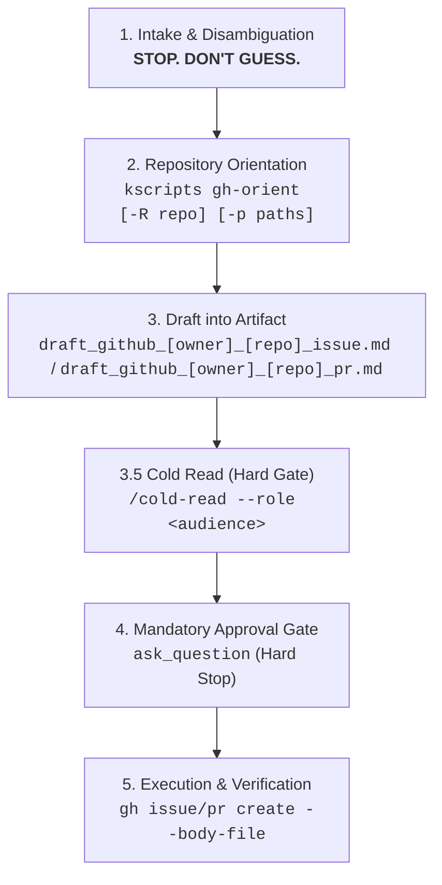

# GitHub Post (`/gh-post`)

Guidelines, automated orientation tooling, and execution protocols for authoring
and submitting high-signal, anti-slop GitHub issues and pull requests without AI
formatting noise.

## Quick Start

```bash
# Orient with a local Git repository checkout's conventions:
kscripts gh-orient --dir /path/to/repo

# Orient with a remote GitHub repository (zero local clone required):
kscripts gh-orient -R invertase/melos
```

## Invocation Style & Slash Command

Trigger the skill via the `/gh-post` slash command or natural language
equivalents:

```markdown
/gh-post a PR with these changes
/gh-post a new issue requesting the feature we discussed
/gh-post a bug report for the crash when passing empty config
/gh-post draft a feature proposal for smart dependent versioning in invertase/melos
```

## The 5-Step Workflow


```mermaid
graph TD
    A["1. Intake & Disambiguation<br><b>STOP. DON'T GUESS.</b>"] --> B["2. Repository Orientation<br><code>kscripts gh-orient [-R repo] [-p paths]</code>"]
    B --> C["3. Draft into Artifact<br><code>draft_github_[owner]_[repo]_issue.md</code> / <code>draft_github_[owner]_[repo]_pr.md</code>"]
    C --> C2["3.5 Cold Read (Hard Gate)<br><code>/cold-read --role &lt;audience&gt;</code>"]
    C2 --> D["4. Mandatory Approval Gate<br><code>ask_question</code> (Hard Stop)"]
    D --> E["5. Execution & Verification<br><code>gh issue/pr create --body-file</code>"]
```

### Step 1: Intake & Disambiguation (STOP. DON'T GUESS.)

The agent MUST have crystal-clear clarity on two fundamental parameters before
doing any work:

1. **Target Post Type**: Is this an **Issue** (Bug Report, Feature Proposal) or
   a **Pull Request**?
2. **Target Repository**: Which exact GitHub repository (`owner/repo`)?

> [!IMPORTANT]
>
> **STOP. DON'T GUESS.** If the user's intent is ambiguous (e.g. _"create a post
> for this"_ without specifying Issue vs. PR), or if the target repository
> cannot be deterministically resolved from the current git checkout, or if
> multiple remotes/forks exist: **The agent MUST STOP and explicitly ask the
> user for clarification** using `ask_question` or chat before proceeding. Never
> guess or fabricate targets.

### Step 2: Repository Orientation

Before drafting, run `kscripts gh-orient` (or the bare `gh-orient` shim) to
inspect the target repository's maintainers, title prefixes, label vocabulary,
native templates, and audience:

```bash
kscripts gh-orient --dir <path-to-repo> -p lib/src/foo.dart -p lib/src/bar.dart
kscripts gh-orient -R <owner/repo> -p packages/foo/lib/foo.dart
```

- **What it gathers**: Active human maintainers (filtering out bots), common
  issue title prefixes (`request:`, `[analyzer]`, `area/foo:`), PR title
  prefixes (`feat(scope):`, `fix(scope):`, `chore:`), repository label
  vocabulary, detected issue/PR form schemas (`.yml` field IDs), and an
  **Audience** line.
- **Audience (`-p, --paths`)**: Pass the repository-relative paths the draft
  references. `owner` means the likely reader wrote or maintains that code
  (small repository, or one author dominates the paths): give zero background
  and open with what is wrong or what changes. `visitor` means rotating or
  distributed triage: give one orienting line plus a permalink, then the defect.
  When unsure the tool answers `visitor`.
- **No Unsolicited `@mention` Guardrail**: On GitHub, inline `@username`
  mentions act as the CC mechanism and immediately trigger public notifications
  and issue subscriptions. Use maintainer handles from `gh-orient` _strictly_
  for internal context—**NEVER** add unsolicited `cc @username` mentions to
  issue or PR bodies unless explicitly instructed by the user.
- **Slop Contagion Guardrail**: Use orientation output _strictly_ for taxonomy,
  prefixes, and template adherence, and keep plain declarative prose regardless
  of the decorative emojis or conversational fluff found in historical
  repository posts.

### Step 3: Draft into an ARTIFACT First

Always draft the complete title and body into a dedicated Markdown artifact in
the conversation artifact directory (`<appDataDir>/brain/<conversation-id>/`)
before touching the GitHub CLI, explicitly namespaced by repository:

- **For Issues**: `draft_github_<owner>_<repo>_issue.md`
- **For Pull Requests**: `draft_github_<owner>_<repo>_pr.md`

Always include `# <Proposed Title>` at **Line 1** of the draft artifact
(followed by a blank line on Line 2) so the user reviews the exact title
alongside the body, and strip lines 1–2 (`tail -n +3`) when passing
`--body-file` to `gh issue create` or `gh pr create`. Always provide
`ArtifactMetadata` with `RequestFeedback: false` and `UserFacing: true` (gating
execution via Step 4's `ask_question`). Consult
[`references/templates.md`](references/templates.md) for the complete Bug
Report, Feature Proposal, Pull Request templates, title pattern tables, and
GitHub YAML Issue Form field mappings.

#### Core Philosophy: Five Principles + GitHub Mechanics

Maintainers suffer from low-effort LLM fatigue. A good submission lets its
reader decide in under 15 seconds. Write for the reader's next decision, not for
the record of your work:

1. **Lead with the decision.** Sentence 1 of the body (Line 3 of the draft
   artifact, right below `# <Proposed Title>`) states the exact defect, ask, or
   change. Discovery history (_"Commit X and PR Y added..."_), process narrative
   (_"While investigating the codebase..."_), and `### Summary` or `### Context`
   headers above it go last, in `<details>`, or away.
2. **Budget words by reader count.** Title: hundreds of readers, search key +
   decision signal, `<= 70` chars. First 3 lines: tens, enough to triage or
   review. Body: one reader, repro + evidence + permalinks. Keep the visible
   gist to `<= 8–12` lines.
3. **Report the delta, not the tour.** Open with what is wrong or what changes.
   An `owner` audience already knows how their code works today and what stays
   unchanged, so cut both "currently, X does Y" openers and "existing mechanics
   X, Y, Z remain sound" summaries; a `visitor` audience gets one orienting line
   plus a permalink.
4. **Fill a slot only if it changes a decision.** Delete empty template
   sections, headers over single paragraphs, parenthetical asides, `---`
   dividers, decorative emojis, pleasantries, and speculative architecture
   essays. One audience and one owner per post: split distinct subsystems/teams
   into separate issues. Limit proposed fixes to 1–3 concrete bullets.
5. **Anchor, verify, then cold-read.** Every claim carries a GitHub `https://`
   permalink
   (`https://github.com/<owner>/<repo>/blob/<commit>/<file>#L<start>-L<end>`) or
   a plain backtick repository-relative path (`` `lib/src/foo.dart` ``)—never a
   local `file://` workstation URL, since `--body-file` pipes the draft verbatim
   to GitHub. Inference is labeled as inference; PR bodies state what changed
   and how it was verified within the first 3 lines (do not add a second
   `### Verification` section repeating the opening `Verified:` line).
   Encapsulate verbatim CLI output, stack traces, code traces, and full
   benchmark tables inside
   `<details><summary><b>Detailed Breakdown, Repro Steps & Measurements (AI-assisted)</b></summary>`
   (blank line after `</summary>` and before `</details>`; no narrative prose
   inside). Then run Step 3.5.

GitHub-specific mechanics:

- **No Unsolicited `cc @username` Mentions**: Never append `cc @user1 @user2` to
  issue or PR descriptions unless the user explicitly asks to mention specific
  people.
- **Tight Declarative Prose**: Short, declarative sentences and bullets rather
  than multi-clause narrative paragraphs or dramatized severity adjectives.
- **No Inline Multiline Shell Escapes**: Never pass multiline Markdown inline
  via `--body "line 1\nline 2"`. Always use `--body-file`.
- **Manual Web Form Mode**: If the user asks for a link to the repo's issue form
  to paste manually, provide a pre-filled
  `https://github.com/<owner>/<repo>/issues/new?title=...` URL artifact.

#### Explicit 3D Paranoia Header for PR Draft Previews (`OQ3`)

At the top of every PR draft artifact preview
(`draft_github_<owner>_<repo>_pr.md`, immediately below `# <Proposed Title>`)
and in chat, display the computed **3D Paranoia Classification** line:

```markdown
🛡️ Paranoia Tier: Ring <0..4B> (<Label>) · Confidence: <High|Low> · Door: <🚪 One-Way | 🔄 Two-Way>
```

| Dimension      | Values & Classification Rules                                                                                                                                                                                                                                                                                                                            |
| :------------- | :------------------------------------------------------------------------------------------------------------------------------------------------------------------------------------------------------------------------------------------------------------------------------------------------------------------------------------------------------- |
| **Reuse Ring** | `Ring 0` (Personal dotfiles & private configs: `personal_dotfiles`) · `Ring 2` (Public skills & utilities: `kevmoo_skills`, `scripts.dart`) · `Ring 3` (Published `pub.dev` packages: `analytica.dart`, `json_serializable`) · `Ring 4A` (Upstream Dart/Flutter framework & packages) · `Ring 4B` (Upstream C++, Dart VM internals, WIMP, Skwasm engine) |
| **Confidence** | `High` (Pure Dart, CLI, package & framework code) · `Low` (Unfamiliar C++, VM internals, WIMP/Skwasm/engine plumbing)                                                                                                                                                                                                                                    |
| **Door Type**  | `🚪 One-Way` (Public `api.txt` / CLI flag / JSON schema delta, SemVer `-wip` bump, DB migration, CI release workflow) · `🔄 Two-Way` (Internal `lib/src/` refactors, isolated tests, docs)                                                                                                                                                               |

_Note_: Strip the `# <Proposed Title>` line and the `🛡️ Paranoia Tier:` preview
banner when passing `--body-file` in Step 5 so the published GitHub PR body
begins with the one-sentence change summary.

#### Conditional `Flow / Surface Delta` Rubric for PRs (`FU3`)

Include a compact ASCII flow, `diff`, Mermaid diagram, or benchmark delta table
inside
`<details><summary><b>Flow / Surface Delta and design notes (AI-assisted)</b></summary>`
(below the file-level change bullets) **only** when at least one trigger holds:

1. **Public API / CLI / Config Surface Changes**: `api.txt` changes, new or
   modified CLI flags/subcommands, exit codes, or config/JSON schemas (render a
   compact `Before -> After` ASCII or `diff` block `<= 12` lines).
2. **Multi-File Control-Flow or State Routing (`>= 3` files)**: `>= 3`
   production files have altered control-flow, pipeline stages, or state
   transitions (render a compact ASCII pipeline or `<= 6-node` Mermaid
   `flowchart LR` / `sequenceDiagram` with `<= 50 chars` per node label).
3. **Benchmark / Hot-Path Architecture Changes**: Algorithmic or hot-path
   performance changes (render a compact `Before vs. After` delta table).

**Omission Rule**: If none of the three triggers hold (e.g., isolated bug fix,
single-file refactor, test/doc update), **omit** the `Flow / Surface Delta`
block entirely.

### Step 3.5: Cold Read (Hard Gate for Issue and PR Bodies)

Before the approval gate, hand the **publish form** of the draft to a
fresh-context reader via the `cold-read` skill
([kevmoo/kevmoo_skills](https://github.com/kevmoo/kevmoo_skills)); if it is not
installed, spawn a read-only subagent with the same three inputs (its persona,
the role and N=3, the file path) and nothing else from this conversation.

1. **Publish form**: issues `tail -n +3 <draft>`, PRs `tail -n +5 <draft>`
   (title and preview banner stripped), with `# <Proposed Title>` re-added as
   line 1 so the reader sees what GitHub shows.
2. **Role** from Step 2: issue + `owner` → `--role owner`; issue + `visitor` →
   `--role triager`; any PR → `--role reviewer`.
3. **Gate**: proceed only when `verdict` is `decide_in_n` and `cut_list` has no
   entries outside repository-required PR checklists (such as CLA / tree-hygiene
   checklists). Otherwise move the deciding sentence to the first body line,
   apply the `cut_list` (preserving repository-required PR checklists), add the
   `missing` facts, and re-run once.
4. **Skip** for comments and replies of `<= 50` words.

### Step 4: Two-Layer Pre-Chew Gate & Concise Change Explanation (Hard Stop)

Separate **Layer A (Internal Pre-Chew Brief for the human author)** from **Layer
B (Outbound GitHub Payload)**:

1. **Layer A (Internal Pre-Flight Brief)**: Before running `gh issue create` or
   `gh pr create`, emit a concise internal explanation (`<= 50` lines in chat)
   covering (1) title & audience/routing rationale, (2) major code changes or
   verified root causes by file, (3) test coverage executed, and (4) the Step
   3.5 result in one line (verdict, decision line, words above the fold). Never
   leak Layer A's internal forensic trace into the published GitHub body unless
   encapsulated inside a `<details>` appendix.
2. **Layer B (Outbound Payload Approval)**: Halt execution and prompt the user
   via `ask_question` so they can pre-chew/adjust the human gist or approve
   submission:
   - Option 1: `(Recommended) Yes, create <issue|PR> via gh <issue|pr> create`
   - Option 2: `No, keep as draft only (let me edit/pre-chew the framing)`

### Step 5: Execution & Verification

1. **Pre-PR Check (For PRs in `~/github/kevmoo/*`)**: Run `kscripts pr-check`
   before creating a PR.
2. **Strip Draft Header & Submit via `--body-file -`**:
   ```bash
   # For Issues (strip Line 1 '# <Proposed Title>' + Line 2 blank line):
   tail -n +3 <draft_artifact_path> | gh issue create -R owner/repo \
     --title "[subsystem] Imperative Title" --body-file -

   # For Pull Requests (strip '# <Proposed Title>' + '🛡️ Paranoia Tier:' header):
   tail -n +5 <draft_artifact_path> | gh pr create \
     --title "feat(scope): imperative summary" --body-file -
   ```
3. **Verify Output**: Confirm submission succeeded and output the clickable
   link.

## Title Conventions & Templates

- **Concise, Imperative Titles (`<= 70` chars)**: Adopt the repository's issue
  prefix convention (`request: ...`, `[subsystem] ...`, `area/foo: ...`) for
  Issues, and Conventional Commits (`feat(scope): ...`, `fix(scope): ...`) for
  PRs unless the repository mandates an alternative.
- **Full Templates & YAML Form Mappings**: See
  [`references/templates.md`](references/templates.md).
